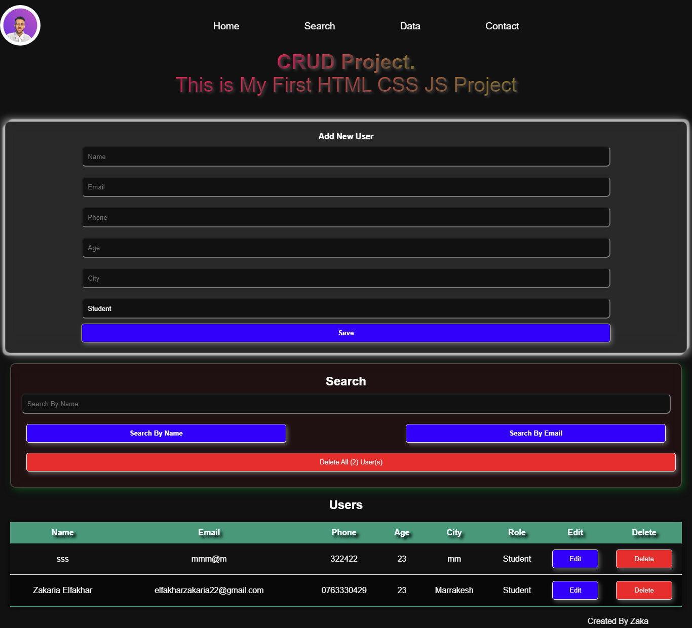

#  JavaScript CRUD App with Local Storage

##  Project Overview
This is a **simple CRUD (Create, Read, Update, Delete) application** built with **HTML, CSS, and JavaScript**. It allows users to **add, edit, search, and delete records**, with data stored in **Local Storage**, ensuring persistence even after refreshing the page.

##  Features
✅ Add new records  
✅ Edit existing records  
✅ Delete records  
✅ Search functionality  
✅ Data persistence with Local Storage  
✅ Responsive design with smooth UI animations  

## 🎥 Demo Preview
**Try the project live here:** [zakariafirstwebproject.netlify.app](https://zakariafirstwebproject.netlify.app/)  
---

## 🛠️ Technologies Used
- HTML5  
- CSS3 (including animations for better UI)  
- JavaScript (ES6+)  
- Local Storage API  
